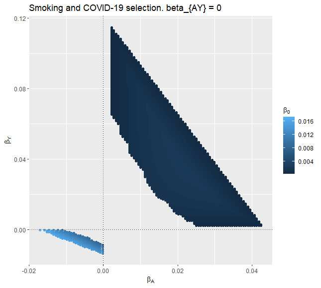
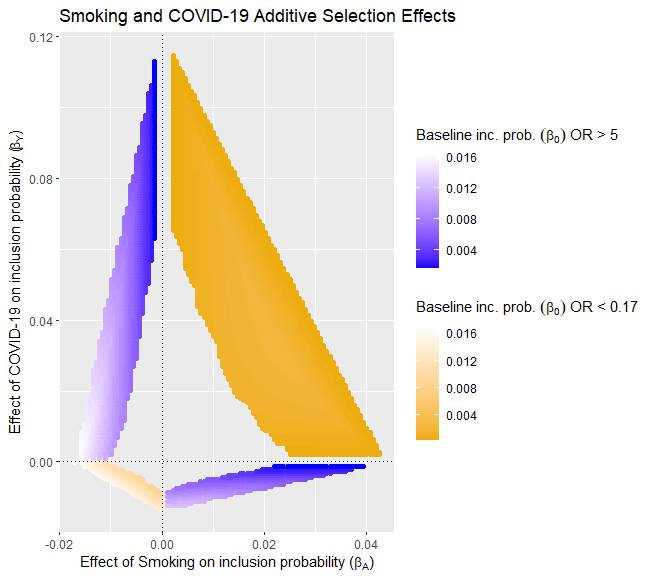
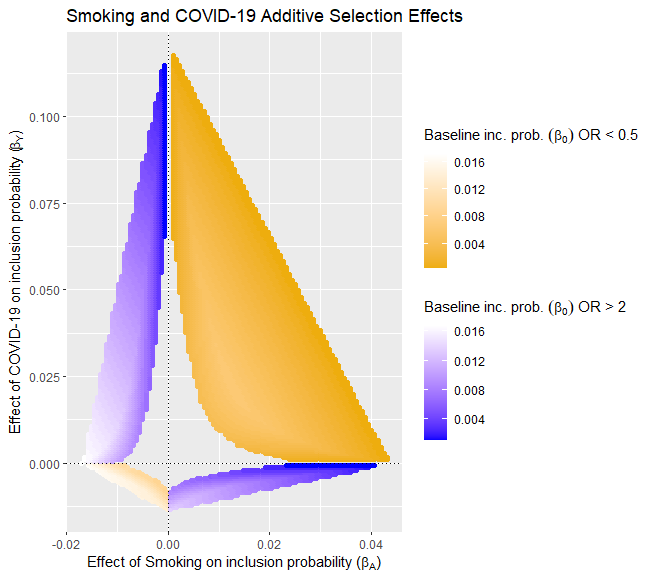

Following [Groenwold et al.](https://osf.io/vrcuf/) (2019) we can calculate the biased OR for a binary exposure $(A)$ on a binary outcome $(Y)$ when both influence the probability of being present in the sample $(S)$.

Let us assume that being present in the sample is conditional on these two binary traits. We may then express an individual's chance of being present in the sample as a combination of four probabilities:

$$\mathbb{P}(S=1|A,Y)=\beta_0+\beta_AA+\beta_YY+\beta_{AY}AY$$

*Where:*

$\beta_0$ is the baseline probability of any individual to be a part of our sample. In order for any generalisation to be made, this needs to be non-zero, otherwise sampling is solely a function of the exposure and outcome. 

$\beta_A$ is the differential probability of being sampled for individuals in the exposed group $(A=1)$.

$\beta_Y$ is the differential probability of being sampled for cases $(Y=1)$.

$\beta_{AY}$ is the differential probability of being sampled for cases in the exposed group $(A=1,Y=1)$.

Given this, we may derive the expected odds ratio, which gives:

$$E[\widehat{OR}_{S=1}]=\dfrac{\beta_0(\beta_0+\beta_A+\beta_Y+\beta_{AY})}{(\beta_0+\beta_A)(\beta_0+\beta_Y)}$$

A way to use this in a sensitivity analysis is to determine for a given fraction of population sampled $(pS)$, and known prevalence of outcome and sampling, what set of possible selection effects ($\beta*$) would give rise to a given odds ratio ($OR_{S=1}$) under a true null effect $(OR=1)$. 

For the purposes of sensitivity analyses, we are solely interested in the $\beta$ parameter values that approximately give rise to our specified value of $pS$::

$$pS=\beta_0+\beta_Ap_A+\beta_Yp_Y+\beta_{AY}p_{AY}$$
  

Substituting in known values of $p_A$, $p_Y$ and $p_{AY}$ allows us to calculate $pS$ for a given $\beta_0$, $\beta_A$, $\beta_Y$ and $\beta_{AY}$. We then take all $\beta_*$ combinations which satisfy our $pS$ conditions, and calculate $E[\widehat{OR}_{S=1}]$ for all combinations. We can then present the combination of $\beta_*$ estimates which give rise to the bounds of $pS$ and the observed $OR$.

For any given $\beta_*$ values, we can simulate independent exposure and outcome data under selection pressures, and we should recapitulate our observed $OR$. 

The `AscRtain::parameter_space()` function performs this analysis, and this shiny app is a wrapper for that function.

A simplified demonstration of this method is provided below. For a version of the example below taken directly from the literature see our [preprint](medrxiv.org/content/10.1101/2020.05.04.20090506v3 "Collider Bias undermines our understanding of COVID-19 disease and severity"). For simplicity we omit discussion of the $\beta_{AY}$ interaction term here.

### Smoking and COVID-19: A worked example

Let's take an example from the literature that emerged around smoking and COVID in the early stages of the pandemic, a [preprint](https://www.preprints.org/manuscript/202004.0540/v1 "What is Happening with Smokers and COVID-19? A Systematic Review and a Meta-Analysis") detailing a meta-analysis of 18 published studies of smoking and COVID-19 reported an OR for current smoking and hospitalisation of 0.17 (95% CI 0.13-0.21) amongst Chinese studies.

We have written explainers on why inferring from relationships from hospitalised patients may be subject to collider bias [[1](https://www.hdruk.ac.uk/news/we-should-be-cautious-about-associations-of-patient-characteristics-with-covid-19-outcomes-that-are-identified-in-hospitalised-patients/),[2](https://rss.onlinelibrary.wiley.com/doi/10.1111/1740-9713.01413)]. For the purposes of explanation here, let's assume that there is no interaction between the selection processes for smoking and COVID-19 into a hospitalised sample. That is, the selection forces acting on an individual who both smokes and has COVID-19 are equal to the sum of their constituent $\beta$ estimates.

To estimate plausible selection processes, we must input figures for $p_S$ (the proportion of the population sampled), $p_A$ (the population prevalence of smoking), and $p_Y$ (the population prevalence of COVID-19). We are exploring the chance of generating an OR of 0.17 under a null true relationship, thus there is no relationship between smoking and COVID-19, and so $p_{AY}$ is simply $p_Ap_Y$. We take $p_A$ from a population prevalence estimate of smoking in China (27.7%) [[3](https://www.ncbi.nlm.nih.gov/pmc/articles/PMC6546632/)]. We also assume COVID prevalence in the population at this point was 10%. Finally, we must provide a value for $p_S$. This is perhaps the strongest assumption, as we are unsure what fraction of the target population the 5023 individuals in the meta-analysis constitute, although for the purposes of this demonstration we will assume this represents 0.01 of the target population.

### AscRtain Input

We can then input this into `AscRtain` for a binary collider structure using the `parameter_space()` function.

First we must initialise a new VBB (**V**-structure, **B**inary-exposure, **B**inary-outcome) structure
```{r}
library(AscRtain)
x <- VBB$new
x
#> <VBB>
#>   Public:
#>     clone: function (deep = FALSE) 
#>     histogram: function (bins = 30) 
#>     or_calc: function (b0, ba, by, bay) 
#>     param: NULL
#>     parameter_space: function (target_or, pS, pA, pY, pAY, b0_range, ba_range, by_range, 
#>     ps_calc: function (b0, ba, by, bay, pA, pY, pAY) 
#>     scatter: function () 
#>     scatter3d: function (ticktype = "detailed", theta = 130, phi = 0, bty = "g",

```


We can calculate an $OR$ if we input $\beta_*$ estimates.
```{r}
x$or_calc(b0=0.1, ba=0.5, by=0.5, bay=0.2)
#> [1] 0.3611111
```

Now for given target odds ratio, we wish to explore whether the observed result could be explained solely by sample ascertainment. For this we use the `AscRtain::parameter_space()` function. 

`parameter_space()` takes 10 arguments, which are as follows:  
  
  `target_or`     is the observed $OR$.  
  `pS`            is the proportion of the target population in the sample **P(S=1)**.     
  `pA`            is the proportion of the population who are in the exposed group **P(A=1)**.   
  `pY`            is the proportion of the cases in the population **P(Y=1)**.   
  `pAY`           is the proportion of the population who are both exposed *and* cases **P(A=1, Y=1)**.  
  `b0_range`      is the range of $\beta_0$ values we want to explore.  
  `ba_range`      is the range of $\beta_A$ values we want to explore.  
  `bay_range`     is the range of $\beta_{AY}$ values we want to explore.  
  `granularity`   is the resolution of the $\beta_*$ ranges we wish to explore (default is 100).  
  
For the result we suspect may be the result of an ascertained sample, we can input known population values.
```{r}
x$parameter_space(
  target_or= 0.17,
  pS=0.01, 
  pA=0.277,
  pY=0.1,
  pAY=0.0277,
  b0_range=c(0,0.2), 
  ba_range=c(-0.1, 0.2), 
  by_range=c(-0.1,0.2), 
  bay_range=c(0,0), 
  granularity=200
)
#> 8000000 parameter combinations
#> 41784 within pS_tol
#> 762 beyond OR threshold
```

Which parameter values for selection effects give rise to an OR at least as extreme as 0.17 under a true null effect.

```{r}
x$param
# A tibble: 762 x 9
#>      pA    pY    pAY     b0        ba       by   bay     ps1       or
#>   <dbl> <dbl>  <dbl>  <dbl>     <dbl>    <dbl> <dbl>   <dbl>    <dbl>
#> 1 0.277   0.1 0.0277 0.0131 -0.000503 -0.0126      0 0.0117  7.18e-15
#> 2 0.277   0.1 0.0277 0.0131 -0.00201  -0.0111      0 0.0114  2.04e-15
#> 3 0.277   0.1 0.0277 0.0131 -0.00352  -0.00955     0 0.0111  1.35e-15
#> 4 0.277   0.1 0.0277 0.0151 -0.00653  -0.00804     0 0.0125  1.26e- 1
#> 5 0.277   0.1 0.0277 0.0131 -0.00503  -0.00804     0 0.0109  5.61e-15
#> 6 0.277   0.1 0.0277 0.0101 -0.00201  -0.00804     0 0.00869 8.63e-15
#> 7 0.277   0.1 0.0277 0.0151 -0.00804  -0.00653     0 0.0122  1.26e- 1
#> 8 0.277   0.1 0.0277 0.0131 -0.00653  -0.00653     0 0.0106  5.31e-15
#> 9 0.277   0.1 0.0277 0.0121 -0.00503  -0.00653     0 0.0100  1.56e- 1
#> 10 0.277   0.1 0.0277 0.0101 -0.00352  -0.00653     0 0.00842 6.07e-15
# ... with 752 more rows
```

We can see that there are many values of $\beta_A$ and $\beta_Y$ which meet the target odds ratio. In order to get a feel for these, let's visualise them. 

```{r}
x$scatter()+ 
  ggplot2::geom_vline(xintercept=0, linetype="dotted") + 
  ggplot2::geom_hline(yintercept=0, linetype="dotted") + 
  ggplot2::ggtitle("Smoking and COVID-19 selection. beta_{AY} = 0")
```
   

We can see from the scatter plot above, that with relatively subtle changes in selection effects, we can induce ORs of a large magnitude. This example has excluded the possibility of the interactive effect on sample membership of both COVID-19 and smoking status, but this further complicates matters. There is a more comprehensive discussion of this in the medrxiv [preprint](https://www.medrxiv.org/content/10.1101/2020.05.04.20090506v3) that accompanies this app. 

Let's go further - and investigate possible selection effects which could give rise to an OR indicating a 5-fold risk instead of a 5-fold protective effect of smoking on COVID-19 caseness. This can give us an indication of how sensitive our findings are to selection effects, which can help us interrogate the likelihood of our observed results generalising in external situations. 

We can simply initialise another *VBB* with equivalent population prevalence estimates for *A*, *Y* and *AY*, but specify an observed *OR* of 5. 

```{r}
x1 <- VBB$new()
x1$parameter_space(
  target_or=5, 
     pS=0.01, 
     pA=0.277,
     pY=0.1,
     pAY=0.0277,
     b0_range=c(0,0.2), 
     ba_range=c(-0.1,0.2), 
     by_range=c(-0.1,0.2), 
     bay_range=c(0,0), 
     granularity=500
 )
 
SmokingColliderCombined <- x$param %>% 
        ggplot2::ggplot(., aes(x=ba, y=by))+
        ggplot2::geom_point(aes(colour=b0))+
        ggplot2::labs(colour = expression (paste("Baseline inc. prob. ", (beta[0]), " OR < 0.17"))) +
        ggplot2::scale_colour_gradient(low="darkgoldenrod2", high="white")+
        ggnewscale::new_scale_colour() +
        ggplot2::geom_point(data=x1$param, aes(colour = b0))+
        ggplot2::scale_colour_gradient(low= "blue", high="white")+
        ggplot2::labs(x = expression(paste("Effect of Smoking on inclusion probability (", beta[A],")")),
                      y=expression(paste("Effect of COVID-19 on inclusion probability (", beta[Y], ")")),
                      colour = expression(paste("Baseline inc. prob. ", (beta[0])," OR > 5")))+
        ggplot2::ggtitle("Smoking and COVID-19 Additive Selection Effects")+
        ggplot2::geom_hline(yintercept=0,size=0.2, linetype="dotted")+
        ggplot2::geom_vline(xintercept=0, size=0.2, linetype="dotted")

SmokingColliderCombined
  
```




We can see from the combined figure that there are a large range of possible selection values which could give rise to an observed relationship of a five-fold protective or risk-increasing relationship, under a true null effect. Remember, this is without including the possibility of interactive effects on participation for both exposure and outcome. It is also clear that these are highly sensitive to the specification of $\beta_0$, as the lower the baseline likelihood of sampling, the more likely it is that we are inducing relationships solely as a product of selection, as selected groups make up a larger proportion of the sample. We bounded this for the example above between 0 and 0.2, but it is clear that we only get such extreme ORs when $\beta_0$ is low. Unfortunately, $\beta_0$ is also one of the most difficult parameters to posit hypothetical values for as it is sensitive to study-specific sampling procedure and specification of target population. Moreover, these are often described in inadequate detail to parameterise this in secondary sensitivity analyses, which are most effective when carried out by primary researchers, to minimise researcher degrees of freedom.

We can explore the sensitivity of ORs to selection processes using the same process. If we hypothesise a two-fold elevated risk or protective effect of smoking and produce the same graphic, we can see how different selection processes must be between extreme and less extreme observed relationships. Below is the same graphic but with OR of 2 and 0.5 shaded. 

```{r}

x2 <- VBB$new()
x2$parameter_space(
  target_or=2, 
     pS=0.01, 
     pA=0.277,
     pY=0.1,
     pAY=0.0277,
     b0_range=c(0,0.2), 
     ba_range=c(-0.1,0.2), 
     by_range=c(-0.1,0.2), 
     bay_range=c(0,0), 
     granularity=500
 )


x3 <- VBB$new()
x3$parameter_space(
  target_or=0.5, 
     pS=0.01, 
     pA=0.277,
     pY=0.1,
     pAY=0.0277,
     b0_range=c(0,0.2), 
     ba_range=c(-0.1,0.2), 
     by_range=c(-0.1,0.2), 
     bay_range=c(0,0), 
     granularity=500
 )
 
x3$param %>% 
    ggplot2::ggplot(., aes(x=ba, y=by))+
    ggplot2::geom_point(aes(colour=b0))+
    ggplot2::labs(colour = expression (paste("Baseline inc. prob. ", (beta[0]), " OR < 0.5"))) +
    ggplot2::scale_colour_gradient(low="darkgoldenrod2", high="white")+
    ggnewscale::new_scale_colour() +
    ggplot2::geom_point(data=x2$param, aes(colour = b0))+
    ggplot2::scale_colour_gradient(low= "blue", high="white")+
    ggplot2::labs(x = expression(paste("Effect of Smoking on inclusion probability (", beta[A],")")),
                  y=expression(paste("Effect of COVID-19 on inclusion probability (", beta[Y], ")")),
                  colour = expression(paste("Baseline inc. prob. ", (beta[0])," OR > 2")))+
    ggplot2::ggtitle("Smoking and COVID-19 Additive Selection Effects")+
    ggplot2::geom_hline(yintercept=0,size=0.2, linetype="dotted")+
    ggplot2::geom_vline(xintercept=0, size=0.2, linetype="dotted")

```


We can see from the Figure above, that the less extreme the OR, the more subtle the selection processes can be - as selection effects producing an observed OR under a true null clearly extend further towards the centre for the twofold risk ratios, relative to the fivefold changes. For a given observed relationship we are essentially positing (in the additive space) that our selection processes fall into the central region of the graph, which diminishes as odds ratios become less extreme.

###  Simulate from parameter values to recapitulate target OR.

For proof of concept, we need to simulate individual level data in which there is no relationship between **A** and **Y** and demonstrate that we can recover the observed, biased OR solely as a function of differential selection pressures. Note that actual population size is not relevant here, it is the proportion of the population sampled that matters. 

Parameters:

```{r}
a <- subset(x$param, by==max(abs(by)))[1,]
a
# A tibble: 1 x 9
#>     pA    pY    pAY       b0      ba    by   bay    ps1    or
#>  <dbl> <dbl>  <dbl>    <dbl>   <dbl> <dbl> <dbl>  <dbl> <dbl>
#> 1 0.277   0.1 0.0277 0.000401 0.00220 0.115     0 0.0125 0.157
```

Simulate from parameters:

```{r}
set.seed(1337)
n <- 1000000
Y <- rbinom(n, 1, a$pY)
A <- rbinom(n, 1, a$pA)
pS <- a$b0 + a$ba * A + a$by * Y
S <- rbinom(n, 1, pS)

```

What proportion of the population **n** are present in our sample **S**?
```{r}
sum(S) / length(S)
#> [1] 0.012493
```

From our simulated population, what is the observed association between *A* and *Y* in the sampled subset?
```{r}
summary(glm(Y~A, family="binomial", subset=S==1))$coef[2,1] %>% exp
#> [1] 0.1264771
```

Compare this to our expected biased association from `x$param`:
```{r}
a$or
#> [1] 0.157
```

We can see that the OR is beyond the target OR that we specified in our research question. Thus we see an OR at least as extreme as our target OR within our sample, solely as a result of selection effects. In this case, if the baseline probability of being in the sample is 0.0004, and smoking increases this by 0.0022, whilst COVID-19 increases this by 0.115, we can find an OR of 0.157 for smoking on COVID-19 caseness, when the true relationship in the population is null. The same process will be true for all combinations of $\beta_0, \beta_A$ and $\beta_Y$ displayed in the scatter plot. 